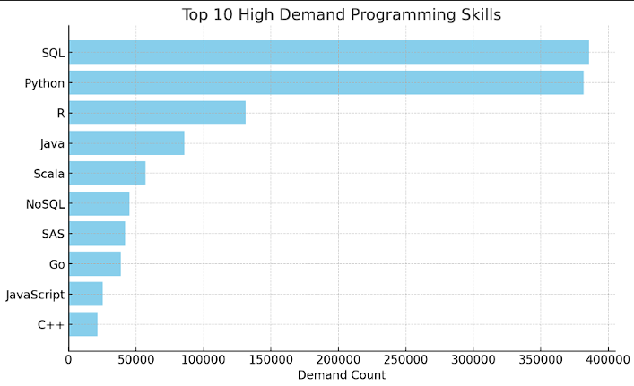
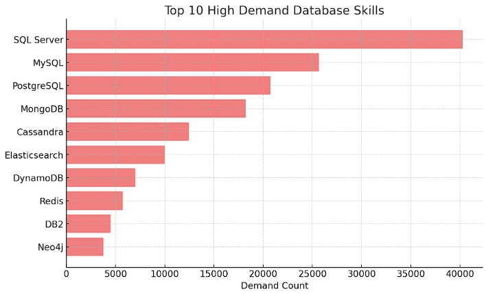
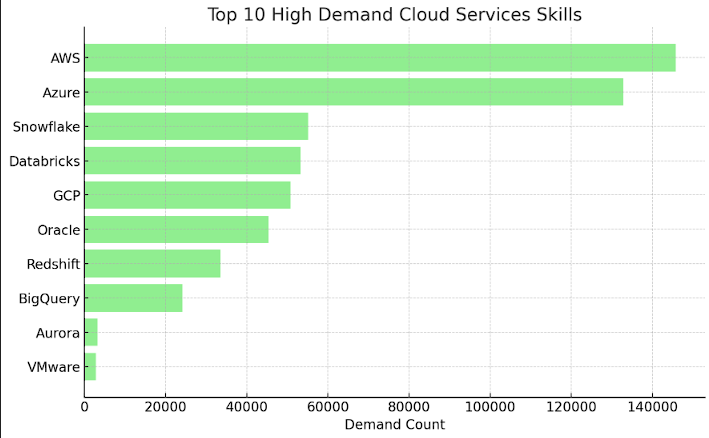
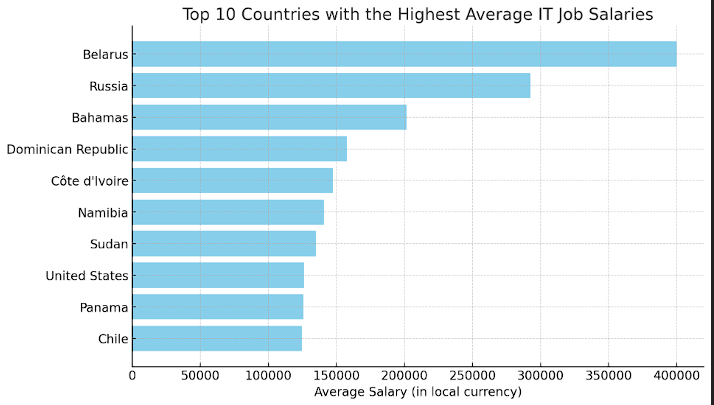

# Introduction
This project is focused on analyzing top-paying jobs and skill demand in the IT field. The primary goal is to enhance my SQL skills by working through real-world data and queries. The project was originally created by [Luke Barrouse](https://www.youtube.com/@LukeBarousse), but I have made modifications to the original questions to better align with my learning objectives. Through this analysis, I aim to gain deeper insights into the IT job market while sharpening my SQL capabilities.

🔍 Shortcut To Project Queries : **[project_files](/project_files/)**

### The Question To Answer
1. What are the top-paying jobs in IT Field?
2. What skills are required for these high-paying IT jobs?
3. What skills are most in demand in the market?
4. Which skills are associated with higher salaries?
5. Which country offer the highest average salary for IT Jobs?

# Tools
This project utilizes a variety of tools to manage, analyze, and version control the data effectively:

- **Visual Studio Code (VSCode)** :
VSCode is the integrated development environment (IDE) used for writing and executing SQL queries. It offers a robust environment with extensions that enhance SQL coding, debugging, and visualization, making it easier to interact with the database and visualize query results.
- **PostgreSQL Database** :
PostgreSQL is the chosen database management system (DBMS) for this project. It is a powerful, open-source relational database known for its reliability, feature robustness, and flexibility. PostgreSQL is used to store, manage, and query the IT job and skills data efficiently.
- **SQL** :
SQL (Structured Query Language) is the language used for querying and analyzing data in this project. It allows for extracting insights from the data stored in the PostgreSQL database by writing and executing complex queries, which is the core of this analysis.
- **Git & GitHub** : Git is the version control system used to track changes to the project's codebase. GitHub is the platform where the project repository is hosted, enabling collaboration, version tracking, and code sharing. All code changes, updates, and version history are managed using Git and pushed to GitHub for easy access and collaboration.

# The Analysis

### 1. What are the top-paying jobs in IT Field?
Here’s a breakdown of the top 5 IT jobs with the highest average salaries based on the provided data:
| **Job Title**              | **Average Salary (USD)** |
|----------------------------|--------------------------|
| Data Scientist             | $585,000                 |
| Data Engineer              | $525,000                 |
| Senior Data Scientist      | $463,500                 |
| Senior Data Engineer       | $425,000                 |
| Senior Data Analyst        | $425,000                 |

***1. Data Scientist As The Leader***

**Average Salary: $585,000**

**Why It Matters** : Data Scientists are in high demand due to their role in turning raw data into actionable insights. This position requires a unique combination of skills in statistics, programming, and domain knowledge, making it the highest-paid among the listed roles.

***2. Strong Demand for Data Engineers***

**Data Engineer Salary: $525,000**

**Senior Data Engineer Salary: $425,000**

**Why It Matters** : Data Engineers are crucial for building and maintaining the systems that handle large volumes of data. Their expertise in big data technologies and cloud infrastructure is highly valued, reflected in their strong compensation.

***3. Experience Will Always Get Paid More***

**Senior Data Scientist Salary: $463,500**

**Senior Data Engineer Salary: $425,000**

**Senior Data Analyst Salary: $425,000**

**Why It Matters** : Senior positions generally offer higher salaries due to the increased responsibilities and expertise required. The salary difference between regular and senior roles highlights the importance of experience and leadership in these fields.
Data-Centric Roles Dominate the List:

 All the top-paying jobs are centered around data—whether it’s analyzing, engineering, or managing it. This trend shows how critical data has become in driving business decisions, optimizing processes, and creating competitive advantages.

### 2. What skills are required for these high-paying IT jobs?
**1. Data Engineer**
1. SQL	    
2. Python    	
3. AWS	    
4. Spark	    
5. Azure     

**Insights** :
SQL and Python are the most critical skills for Data Engineers, indicating the need for strong database and programming expertise.

Cloud platforms like AWS and Azure are also highly valued, along with big data processing frameworks like Spark.

**2. Data Scientist**

1. Python	
2. SQL	
3. R	
4. Tableau	
5. SAS	

**Insights**:
Python leads as the most in-demand skill for Data Scientists, reflecting its versatility in data analysis, machine learning, and automation.

SQL remains essential for data manipulation, while R is also popular in the statistical computing domain.

Tableau and SAS show the importance of data visualization and statistical analysis tools.

**3. Senior Data Analyst**

1. SQL	
2. Tableau	
3. Python	
4. Excel	
5. R	

**Insights**:
SQL is the top skill, which is expected as data analysts must query and manipulate data frequently.

Tableau and Excel highlight the importance of data visualization and spreadsheet tools.
Python and R indicate a need for more advanced analytical skills in senior roles.

**4. Senior Data Engineer**

1. Python	
2. SQL	
3. AWS	
4. Spark	
5. Azure	

**Insights:**
Python and SQL continue to dominate as the most essential skills, showing that even at a senior level, these technical competencies are critical.

Cloud platforms like AWS and Azure are crucial, along with big data tools like Spark, reflecting the importance of scalable data solutions in senior engineering roles.

### 3. What skills are most in demand in the market?
**1. Programming Skiils**

**Insights**:

1. SQL and Python are by far the most in-demand skills, with both having demand counts well above 350,000. These are essential skills in data analysis, data engineering, and software development.

2. R holds a strong position in third place, reflecting its importance in statistical analysis and data science, particularly in academic and research settings.

3. Java and Scala are also highly sought after, especially in backend development and big data processing, with demand counts of 85,854 and 57,058, respectively.

4. NoSQL databases, represented here as a skill, are critical for handling unstructured data, and the demand count of 45,227 indicates significant usage in industry.

5. SAS continues to be important in enterprise analytics, particularly in sectors like finance and healthcare, with a demand of 41,826.

6. Go is emerging as a popular language for cloud-native and concurrent applications, with a demand of 38,752.

7. JavaScript is lower on this list compared to expectations, potentially because the demand for front-end development is often distributed across various frameworks and libraries that aren't captured in this chart.
 
8. C++ remains important in systems programming, gaming, and performance-critical applications, with a demand count of 21,466.

**2. Databases Services**

**Insights:**
1. SQL Server leads the list with the highest demand, indicating its strong presence in enterprise environments for managing large-scale relational databases.

2. MySQL and PostgreSQL follow as the next most in-demand databases, reflecting their widespread use in web development, open-source projects, and cloud-based applications. MySQL, in particular, is popular due to its integration with many web platforms, while PostgreSQL is valued for its advanced features and compliance with SQL standards.

3. MongoDB, a leading NoSQL database, shows strong demand, underscoring the importance of flexible, document-oriented databases in modern, scalable applications.

4. Cassandra also stands out among NoSQL databases, particularly in big data applications requiring high availability and scalability.

5. Elasticsearch is highly valued for search and analytics use cases, especially in environments dealing with large volumes of data that require real-time searching capabilities.

6. DynamoDB represents AWS’s managed NoSQL database service, showing demand driven by its seamless integration with other AWS services and cloud-native applications.

7. Redis, known for its speed as an in-memory data structure store, is commonly used in caching, session management, and real-time analytics, reflecting its niche but vital role.

8. DB2 and Neo4j round out the list, with DB2 continuing to be used in legacy systems within certain industries, and Neo4j gaining traction in graph database application

**2. Cloud Services**

**Insights:**
1. AWS (Amazon Web Services) leads by a significant margin, highlighting its dominance in the cloud computing space. Its extensive range of services and widespread adoption across industries make it the most sought-after cloud skill.

2. Azure, Microsoft's cloud platform, is close behind AWS, reflecting its strong presence in enterprises, especially those already using Microsoft products.

3. Snowflake and Databricks are the most in-demand specialized cloud services, with Snowflake known for its cloud-based data warehousing capabilities and Databricks for its unified analytics platform, particularly in big data processing and machine learning.

4. GCP (Google Cloud Platform) is also in high demand, especially in data analytics, machine learning, and large-scale application development, supported by Google's advanced technologies.

5. Oracle remains a key player, particularly in enterprises that rely on its database services and cloud infrastructure offerings.

6. Redshift, another Amazon service, is popular for data warehousing, showing demand within organizations that manage large-scale data analytics on AWS.

7. BigQuery, part of GCP, reflects Google's strength in handling big data, with demand driven by its serverless, highly scalable, and cost-effective data warehouse.

8. Aurora, a MySQL and PostgreSQL-compatible relational database service from AWS, is in demand for those requiring high performance and availability.

9. VMware shows the least demand in this list, likely due to the shift towards fully managed cloud services, though it remains important in virtualization and on-premises cloud solutions.

### 4. Which skills are associated with higher salaries in the top 5 jobs ?
**1. Data Scientists**

- GDPR (General Data Protection Regulation) is the highest-paying skill for Data Scientists, with an average salary of $217,738. This indicates the high value placed on data privacy and regulatory compliance in the data science field.
- Golang is also highly valued, with a salary of $208,750, reflecting the demand for proficiency in this programming language, particularly for high-performance computing and systems development.
- Atlassian, Selenium, and OpenCV are also well-paid skills, indicating the importance of project management, test automation, and computer vision, respectively.

**2. Data Analysts**
- PySpark is the top-paying skill, with a salary of $208,172, indicating the demand for big data processing capabilities in data analytics.
- Bitbucket and Couchbase also command high salaries, suggesting that skills in version control and NoSQL databases are crucial for data analysts.
- Watson and DataRobot are also high on the list, emphasizing the importance of AI and machine learning tools in the data analyst’s toolkit.

**3. Data Engineers**
- Assembly is the highest-paying skill for Data Engineers, with an average salary of $192,500. This shows the value of low-level programming and system architecture skills in data engineering.
- MongoDB is next, reflecting the need for expertise in handling large-scale NoSQL databases.
- GGPlot2, Rust, and Clojure are also top-paying skills, indicating the importance of data visualization, systems programming, and functional programming in data engineering.

**4. Senior Data Analysts**
- Skills like Keras, Angular, FastAPI, and CSS all command equal high salaries of $185,000. This suggests a strong demand for senior analysts with expertise in deep learning frameworks, front-end development, and web frameworks.
- Golang also appears, showing its importance across multiple roles and indicating versatility as a valuable trait.

**5. Senior Data Engineers**
- Chef is the top-paying skill at $186,500, highlighting the value of configuration management and automation in senior engineering roles.
- Rust and Zoom are also well-compensated, with Rust's importance in systems programming and Zoom's relevance in remote work setups.
- Terminal and Neo4j skills round out the list, reflecting the need for command-line proficiency and graph database expertise.

### 5. Which country offer the highest average salary for IT Jobs?

**Insights**
1. Belarus ranks the highest with an average IT salary of 400,000, which is significantly higher than the other countries.
2. Russia comes second with an average salary of 292,500, which is almost 73% of Belarus' average.
3. The Bahamas and Dominican Republic follow with average salaries of 201,512 and 157,500 respectively.
4. Côte d'Ivoire and Namibia have average salaries close to each other at 147,500 and 140,857 respectively.
5. Sudan offers an average salary of 135,038, slightly lower than Namibia.
United States ranks lower on the list with an average salary of 126,018.
6. Panama and Chile close the list with salaries of 125,500 and 124,918 respectively.
# What I Learned

- **📊 SQL Skills** : Improved my ability to write complex queries, use advanced functions, and optimize performance. Applied these skills to real-world data manipulation and analysis.

- **🎢 Data Analysis** : Gained experience analyzing large datasets related to IT job roles and skill demands, identifying trends in job pay and skill requirements.

- **🛠️ Database Management** : Enhanced my knowledge of PostgreSQL, including setting up databases, importing data, and maintaining integrity.

- **💻 Version Control** : Advanced my version control skills with Git and GitHub, focusing on managing code changes and collaborating effectively.

- **👨‍💻 Project Documentation** : Learned the importance of clear documentation and structured project organization for effective collaboration and future reference.

# Conclusion

This project provided a comprehensive analysis of the IT job market, focusing on top-paying roles, required skills, and geographical salary distributions. By leveraging SQL and PostgreSQL, I explored and gained insights into the intricacies of IT job salaries and skill demands.

### Key takeaways include:

**Top-Paying IT Roles**

- Data-centric roles such as Data Scientist and Data Engineer dominate the top-paying IT jobs, reflecting the critical importance of data in modern businesses.
- Senior positions consistently command higher salaries, highlighting the value of experience and leadership in the industry.

**Skills in Demand**

- SQL and Python are the most in-demand skills across multiple IT roles, emphasizing their importance in data manipulation, analysis, and programming.
- Cloud services like AWS and Azure are also highly sought after, underlining the shift towards cloud computing and big data technologies.

**High-Paying Skills**

- Skills related to data privacy (e.g., GDPR), advanced programming languages (e.g., Golang, Rust), and big data processing (e.g., PySpark) are associated with higher salaries, particularly in specialized roles.

**Geographical Salary Distribution**

- Belarus stands out as the country offering the highest average salary for IT jobs, significantly ahead of other countries like Russia and the Bahamas.
- The United States, despite being a major tech hub, ranks lower in this specific dataset, suggesting variability in IT job compensation across different regions.

### Final Thoughts:
This project was a valuable learning experience, allowing me to apply and refine my SQL skills in a real-world context. The insights gained not only deepened my understanding of the IT job market but also prepared me for more advanced data analysis tasks. 